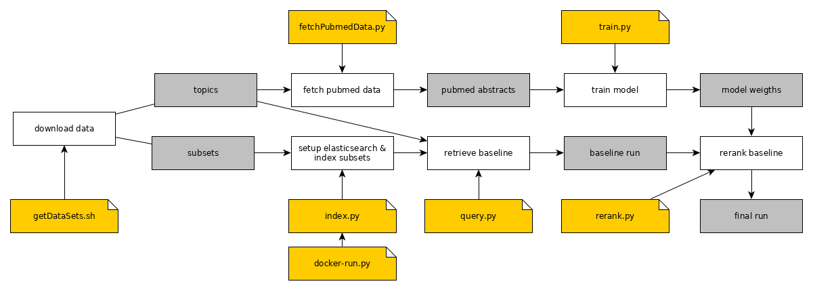

# trec-covid

## Submission details round #1

#### Description:
As part of [TREC-COVID](https://ir.nist.gov/covidSubmit/), we submit automatic runs based on (pseudo) relevance feedback in combination with a reranking approach.
The reranker is trained on relevance feedback data that is retrieved from PubMed/PubMed Central (PMC). 
The training data is retrieved with queries using the contents of the `<query>` tags only.

For each topic a new reranker is trained. We consider those documents retrieved by the specific topic query as relevant training data,
and the documents of the other 29 topics as non-relevant training data.
Given a baseline run, the trained system reranks documents.

The baseline run is retrieved with the default ranker of Elasticsearch/Lucene ([BM25](https://www.elastic.co/guide/en/elasticsearch/reference/7.4/index-modules-similarity.html)) and queries using the contents of the `<query>` tags only.
For our reranker we use [GloVe embeddings](https://nlp.stanford.edu/projects/glove/) in combination with the [Deep Relevance Matching Model (DRMM)](www.bigdatalab.ac.cn/~gjf/papers/2016/CIKM2016a_guo.pdf).

Our three run submissions differ by the way training data is retrieved from PubMed/PMC.
1. `irc_entrez`:  
The first run is trained on titles and abstracts retrieved from the [Entrez Programming Utilities API](https://www.ncbi.nlm.nih.gov/books/NBK25500/) with "type=relevance".
2. `irc_pubmed`:   
The second run is trained on titles and abstracts retrieved from [PubMed's search interface](https://pubmed.ncbi.nlm.nih.gov/) with "best match". We scrape the PMIDs and retrieve the titles and abstracts afterwards.
3. `irc_pmc`:  
The third run is trained on full text documents retrieved from [PMC](https://www.ncbi.nlm.nih.gov/pmc/).

## Workflow 

### Setup
Our retrieval pipeline relies on the following dependencies:  
[[docker](https://docker-py.readthedocs.io/en/stable/)][[elasticsearch](https://elasticsearch-py.readthedocs.io/en/master/)][[requests](https://2.python-requests.org/en/master/)][[beautifulsoup](https://www.crummy.com/software/BeautifulSoup/)][[matchzoo](https://github.com/NTMC-Community/MatchZoo)]

* Install docker. When running on SciComp (Ubuntu VM):  
``` 
sudo usermod -aG docker $USER
```
* Make virtual environment and activate it
``` 
python3 -m venv venv
source venv/bin/activate
``` 
* Install requirements:   
```shell script
pip3 install -r requirements.txt
```  
Run `python3` and install nltk data:  
```shell script
>>> import nltk
>>> nltk.download('punkt')
```
* Download data from [semanticscholar](https://pages.semanticscholar.org/coronavirus-research), extract it and place it in `./data/`. 
``` 
./getDataSets.sh
``` 
* Fetch data for 30 topics from PubMed (will be written to `artifact` directory with timestamp)
```shell script
python3 fetchPubmedData.py
```
* **Optional:** Adapt settings in `config.py`  

### Baseline run 
* Download image and run Elasticsearch container
```shell script
python3 docker-run.py
```
* Index data  
```shell script
python3 index.py
```
* Write baseline run file
```shell script
python3 query.py
```
* **Optional:** Delete the docker container and remove the image  
```shell script
python3 docker-rm.py
```

### Reranking
* Train model for each of the 30 topics and save models to `./artifact/model/<model-type>`
```shell script
python3 train.py
```
* Rerank baseline ranking:
```shell script
python3 rerank.py
```

### `config.py`
| param | comment |
| ---  | --- |
| DOCS | dictionary with index names as keys and paths to data as values |
| BULK | if set to `True` data is indexed in bulk |   
| SINGLE_IDX | if is not `None`, all data is indexed into one instance |   
| TOPIC | path to topic file | 
| BASELINE | name of the baseline run |
| DATA | path to directory with subsets |
| META | path to `metadata.csv` |
| VALID_ID | path to xml file with valid doc ids |
| ESEARCH | pubmed eutils api to retrieve pmids given a query term |
| EFETCH | pubmed eutils to retrieve document data given one or more pmids |
| RETMODE | datatype of pubmed eutils results |
| PUBMED_FETCH | directory to fetched data from pubmed |
| PUBMED_DUMP_DATE | specify date of pubmed data for training |
| MODEL_DUMP | path to directory where model weights are stored |
| MODEL_TYPE | specify model type. at the moment `dense` and `drmm` are supported |
| RUN_DIR | path to the output runs |
| RERANKED_RUN | name of the reranked run |
| PUBMED_SCRAPE | bool. if set to `True`, pmids are scraped from pubmed frontend |
| PUBMED_FRONT | URL of the pubmed frontend |
| RESULT_SIZE | number of results to be retrieved from PUBMED_FRONT |
| RERANK_WEIGHT | weight param for reranker score. `default: 0.5` |

### Datasets
| name | link |
| ---  | --- |
| `comm` | [commercial use subset](https://ai2-semanticscholar-cord-19.s3-us-west-2.amazonaws.com/2020-04-10/comm_use_subset.tar.gz) |
| `noncomm` | [non-commercial use subset](https://ai2-semanticscholar-cord-19.s3-us-west-2.amazonaws.com/2020-04-10/noncomm_use_subset.tar.gz) |   
| `custom` | [custom license subset ](https://ai2-semanticscholar-cord-19.s3-us-west-2.amazonaws.com/2020-04-10/custom_license.tar.gz) |   
| `biorxiv` | [bioRxiv/medRxiv subset](https://ai2-semanticscholar-cord-19.s3-us-west-2.amazonaws.com/2020-04-10/biorxiv_medrxiv.tar.gz) | 